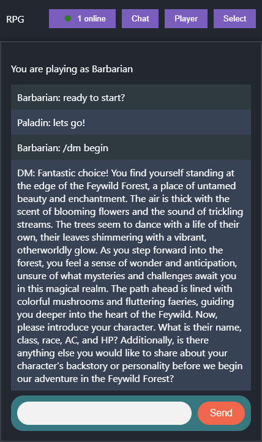

Play Dungeons and Dragons with your friends using an A.I. dungeon master!

Pick a class, chat with your party, and ChatGPT will generate dugeons and handle interactivity!

To run locally, launch the React client and Express server applications.

To message the dungeon master, prefix your chat message with `/dm` i.e. `/dm start the adventure!`



## Development

### Client

- Open a terminal and navigate to the client folder

```console
$ cd client/
```

#### Install Dependencies

```console
$ npm i
```

#### Run Development Server

```console
$ npm start
```

- The client is accessible at http://localhost:3000

### Express Server

- Open a terminal and navigate to the client folder

```console
$ cd server/
```

#### Install Dependencies

```console
$ npm i
```

#### Setup ChatGPT Authentication
- You must add your own ChatGPT API Key
- Create an .env.local file and set OPENAI_API_KEY=your_api_key

#### Run Development Server

```console
$ npm run dev
```

- The server is accessible at http://localhost:8080
