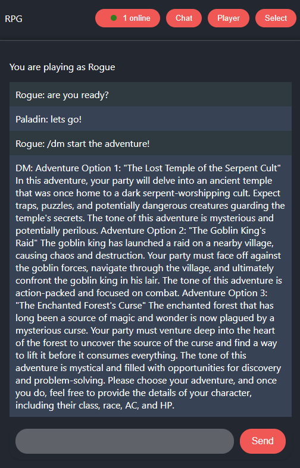

Play Dungeons and Dragons with your friends using an A.I. dungeon master!

Pick a class, chat with your party, and ChatGPT will generate dugeons and handle interactivity!

To run locally, launch the React client and Express server applications.

To message the dungeon master, prefix your chat message with `/dm` i.e. `/dm start the adventure!`



## Architecture

The AI Dungeon Master application is built with a modern web architecture featuring a React frontend, Node.js backend, and real-time communication via Socket.IO. The system integrates with OpenAI's GPT-4o-mini to provide an intelligent dungeon master experience.

### System Overview


### Key Architectural Features

- **React Context Architecture**: State management using multiple context providers for auth, player data, socket connections, and UI routing
- **Real-time Communication**: Socket.IO for instant messaging, room updates, and multiplayer coordination
- **AI Integration**: OpenAI GPT-4o-mini powers the dungeon master with D&D 5e rule knowledge
- **RESTful API**: Express.js backend with organized routes and controllers for data operations
- **MongoDB Integration**: Mongoose models for users, players, rooms, messages, and D&D character classes
- **Session Management**: Persistent user sessions with automatic reconnection support

## Development

### Client

- Open a terminal and navigate to the client folder

```console
$ cd client/
```

#### Install Dependencies

```console
$ npm i
```

#### Run Development Server

```console
$ npm start
```

- The client is accessible at http://localhost:3000

### Express Server

- Open a terminal and navigate to the client folder

```console
$ cd server/
```

#### Install Dependencies

```console
$ npm i
```

#### Setup ChatGPT Authentication
- You must add your own ChatGPT API Key
- Create an .env.local file and set OPENAI_API_KEY=your_api_key

#### Run Development Server

```console
$ npm run dev
```

- The server is accessible at http://localhost:8080
